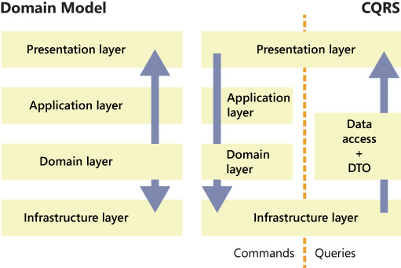
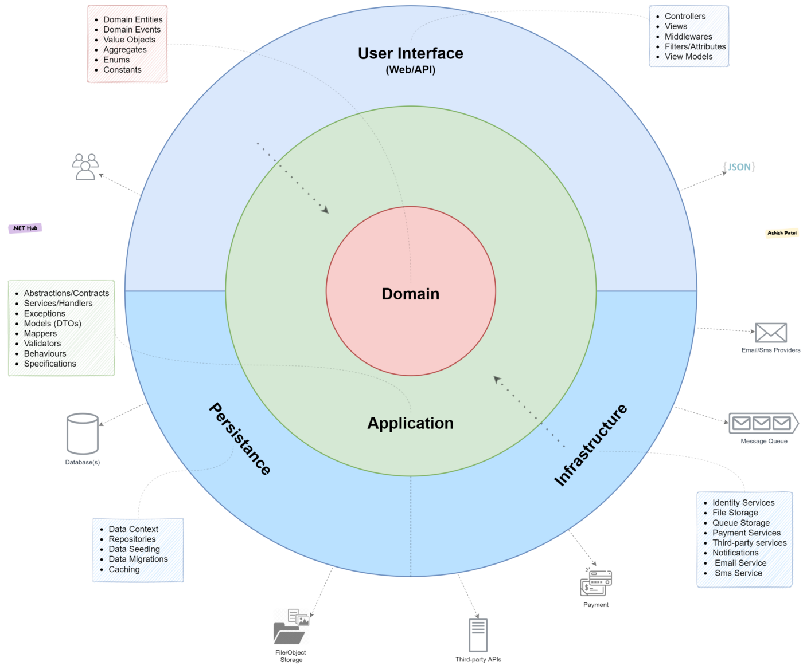

# ASTRUM - Guide for developers

## Introduction

This is a quick description of project architecture
The architecture is based on **Domain-Driven-Design (DDD)**, Clean Architecture and a lot of other approaches which was
chosen by experience and IT leaders opinions.

[//]: #

## Prerequisites

Для того, чтобы начать работать с данной архитектурой, необходимо понимать,
что из себя представляет DDD, Clean Architecture и Microservices.Чтобы ознакомиться можно прочитать следующие статьи:

- [Clean Architecture with .NET and .NET Core — Overview](https://medium.com/dotnet-hub/clean-architecture-with-dotnet-and-dotnet-core-aspnetcore-overview-introduction-getting-started-ec922e53bb97)
- [Microservices Architecture on .NET with applying CQRS, Clean Architecture and Event-Driven Communication](https://medium.com/aspnetrun/microservices-architecture-on-net-3b4865eea03f)

## Overview

Архитектура наточена на поддерживаемость и гибкость.
Она применима для больших проектов с долгим сроком
жизни.
Solution состоит из множества проектов. Каждый проект - логически обособленная часть.
Также Solution разбит на несколько концептуальных частей. Запускаемый проект, Core и модули.

Модуль - логически обособленная единица, которая может иметь набор зависимостей от частей других модулей.
Модуль может быть как самодостаточным микросервисом, так и просто ссылочная assembly.
Модули состоят из следующих слоев (проектов):

1) Domain
2) DomainServices
3) Application
4) Infrastructure
5) Persistence (infrastructure.Persistence)
6) Startup (Название соответствует названию модуля)

*Слои указанные выше имеют вектор зависимостей от меньшего к большему, то есть DomainServices может зависить от Domain,
но не наоборот.
При этом, горизонтальная зависимость между модулями возможна, но тогда нижележащим слоям также желательно проставить
такие зависимости.*

  

Разделение позволяет абстрагировать логические части системы друг от друга в том
числе внутри модуля и позволяет гибко вносить изменения и добавлять реализации в систему.

Всю информацию можно найти в статьях в интернете по тегам DDD, Clean Architecture, но для краткой сводки новичкам
приведу информацию по каждому блоку:

Слои содержат `ServicesCollectionExtensions`, в котором прописывается конфигурация для этого данного слоя.

## Layers in details

### Domain Layer

Это самое ядро, которым могут пользоваться множество модулей. Содержит в себе набор бизнес сущностей.

* **Aggregates** - сущность бизнеса, которую можно инициализировать.
  Абстрактные классы логически не являются агрегатами.
  Наследует `AggregateRootBase<{TId}>`
* **Enums** - Перечисления, используемые в других сущнастях или снаружи.
* **Constants**
* **Events** - События, которые происходят внутри аггрегатов или внутри сервисов домена
  (может быть и снаружи, но событие должно соответствовать логике бизнеса, пределы слоя application не покидает)
  Наследует `DomainEventBase<{TId}>`
* **ValueObjects** - Неизменяемый объект, сравнивается по внутренним полям.
  Наследует `abstract class ValueObject`

**Dependencies:**  
Нет зависимостей внутри текущего модуля, но может быть зависим от других модулей слоя Domain

### Domain Services Layer

Содержит набор сервисов и интерфейсов, описывающих взаимодействие и поведение сущностей домена. Может содержать
имплементации, в которых есть зависимости только от слоя Domain и DomainServices

**Содержит**:

* Abstractions / Contracts
* Services / Handlers
* Exceptions (Уровень бизнеса, взаимодействие между сущностями домена)
* Models (DTOs)
* Mappers
* Validators
* Behaviours
* Specifications - гуглить "паттерн спецификация c#".
  Содержит готовые имплементации выборки для нахождения объекта среди массива подобных объектов.

**Dependencies:**

* Domain
* Domain Services

### Application Layer

Аналогично Domain Services Layer, содержит интерфейсы и имплементации, доступные на уровне Application, DomainServices и
Domain.  
Но на этом слое находятся интерфейсы и сервисы, описывающие логику работы приложения (уже менее связан с бизнесом).  
Например: интерфейсы работы с email, очередями сообщений (**!!!интерфейсы, не реализации**), логирование, Features и
многое другое.

К содержанию Domain Services Layer добавляется:

* Helpers
* Utilities
* Repositories (interfaces)

**Dependencies:**

* Domain
* Domain Services
* Application

### Infrastructure Layer

Задача данного слоя - реализовать все, что не было реализовано на уровне приложения.   
Этот слой может быть не одним проектом в solution, а множеством. По сути для каждого пукта из блока "содержание" может
быть свой Project.

**Содержание**:

* Все со слоя Application
* Identity services
* File storage
* Queue services
* Payment services
* Third-party services
* Notifications (Реакция на события с нижележащих слоев)
* Email services

**Dependencies:**

* Domain
* Domain Services
* Application
* Infrastructure

### Persistence Layer

Общая логика схожа с слоем Infrastructure, и к нему он и относится. Этот "подслой" выделяется среди остальных.
Задача - Настроить работу с сохранением данных и их обработкой.
По простому - слой взаимодействия с БД.

**Содержит:**

* Entities & TypeConfigurations & Mappings (Могут быть вынесены в отдельный проект)
* DbContexts
* Repositories (Implementations)
* Data Seeding
* Data Migrations
* Caching

**Dependencies:**

* Domain
* Domain Services
* Application
* Infrastructure
* Persistence (Из других модулей)

### Backoffice Layer (Server - Client interaction)

Задача слоя - настроить доступ клиентам до модуля.
Это может быть как API, так и MVC.  
Реализация может быть под возвращение View, REST, GraphQL, GRPC, WebSocket и т.п.

**Содержание:**

* Controllers
* Views
* View Models
* Middlewares
* Filters \ Attributes
* Mapping
* Validators

**Dependencies:**

* Application
* Infrastructure (скорее не должен по идее)

### Startup Layer

Задача слоя - Сконфигурировать DI и middleware для быстрого подключения этого независимого модуля.

Данный слой может быть как отдельным приложением, так и просто модулем содержащий реализацию `ICustomModuleInitializer`

---

## Implementation notes

### Important

// TODO не реализовано
Работу с датами желательно осуществлять через сервис IDateTimeService.   
Все даты должны сохраняться и обрабатываться в формате UTC.
Например, получать текущую дату не `DateTime.Now`, а `DateTime.UtcNow`

### Domain

Aggregates должны наследовать `AggregateRootBase<{TId}>`.
Events наследуют `DomainEventBase<{TId}>`.
Aggregate проектируется в соответствии со всеми правилами логики.
Это значит, что здесь есть место приватным сетерам, изменение содержания через методы и наличие конструктора,
указывающего условия, при котором сущность может быть создана.
Также аггрегат должен валидировать свое внутреннее состояние самостоятельно.

**Events**. Все методы аггрегата, включая конструктор, должны содержать валидацию входных данных и вызывать
метод `RaiseEvent(@event)`, который принимает event совершенного над аггрегатом действия.
RaiseEvent увеличивает версионность сущности и вызывает обработчик на уровне аггрегата `IDomainEventHandler<{TEvent}>`,
который должен быть реализован на уровне этого типа. изменение состояния производится уже в самом обработчике. Пример
аггрегата: `User`.  
Также список `_uncommittedEvents` не очищается, что позволяет при выполнении `SaveChangesAsync` в DbContext вызвать
через MediatR все дополнительные обработчики.

[//]: # (TODO Реализовать в BaseEntity: CreatedAt, UpdatedAt, CreatedBy, UpdatedBy IsDeleted)
**TODO** Реализовать в BaseEntity: CreatedAt, UpdatedAt, CreatedBy, UpdatedBy IsDeletedy
это позволяет не удалять сущности на уровне БД, а также сохранять их состояние изменений с течением времени.

### Application

#### MediatR

Система гибка и работает с Events, поэтому явно используется MediatR.  
Поскольку с событиями можно работать и через внешние очереди, то написана базовая реализация
для `Query, QueryHandler, Command, CommandHandler`, использующая интерфейсы медиатра библиотеки **MediatR** и
**MassTransit**.
Это позволяет вызывать обработчики событий как на уровне приложения, так и на уровне внешних брокеров сообщений.

#### Result

Для удобной работы клиентов с API реализован общий формат ответа.
Для этого созданы объекты Result и ResultError. Также есть класс `ResultHelper`, позволяющий создавать Result с нужным
StatusCode и Data.   
Есть набор Extension методов, часть из которых работает по принципу FluentApi.  
Controller получает ответ от обработчика и преобразует его в IActionResult за счет одного из базовых методов
класса `ApiBaseController`, в основном `StatusCodeResponse()`.

Также для удобства при взаимодействии с third-party вызовами ответ также преобразовывать в формат IResult, для
переиспользования существующих Helper'ов.

### Infrastructure

Поскольку много слоев и сущностей для них, то есть необходимость маппинга данных.
Сейчас используется AutoMapper.
В будущем лучше заменить на Mapster т.к. функционал тот же (не знаю на счет expressions), но Mapster быстрее и
возвращает новую сущность.
Automapper изменяет существующую - хорошо для работы с Entities и ChangeTracking.

**Важно:** Automapper, MediatR и другие подобные библиотеки лучше прописывать в `ServiceCollectionExtensions` отдельно
для каждой сборки (проекта).

### Persistence

Поскольку у нас модульная архитектура, то важно использовать несколько DbContexts.
Один модуль соответвует одному или нескольким DbContexts.  
Каждый новый DbContext должен наследовать абстрактный класс `BaseDbContext`, либо реализовать интерфейс `IDbContext`,
если нет возможности .

`BaseDbContext` реализует следующую логику:

- вызывает все обработчики для IDomainEvent, которые не были обработаны.
- **ВАЖНО** находит все IEntityTypeConfiguration из всех связанных модулей, и исключает из миграции сущности не из
  текущей сборки!
- содержит AuditHistory и делает его обработку.
- (**TODO** не работает) Для IAuditableEntities сохраняет UpdatedAt, CreatedAt, UpdatedBy, CreatedBy.
- (**TODO** не реализовано) Переопределяет операцию remove и заменяет ее на `IsDeleted = true`.

**TODO** возможно есть проблема. При сохранении связанной сущности из другого DbContext через репозиторий не того
DbContext,
то может обработаться на корректно сохранение: Audit не сработает или events поломаются.

Есть два типа репозиториев:

* AggregateRepository - обработка aggregates
* EntityRepository - обработка сущностей DB.

**AggregateRepository** должен наследовать `BaseAggregateRepository`. В нем используется EntityRepository для сохранения
аггрегатов.
В целом, если будет модуль выноситься в микросервисы, то на этом уровне будут приниматься другие репозитории и
конструироваться аггрегат из разных источников в том числе баз.

**EntityRepository** - просто реализация получения данных, в данном случае с помощью EntityFramework. Должен
наслодовать `DataEntityRepository`

## Identity

[//]: # (TODO как регистрироваться)

[//]: # (TODO как авторизовываться)

[//]: # (TODO как делать обработку permissions на уровне инфраструктуры)

[//]: # (TODO как делать обработку permissions на уровне пользователя)